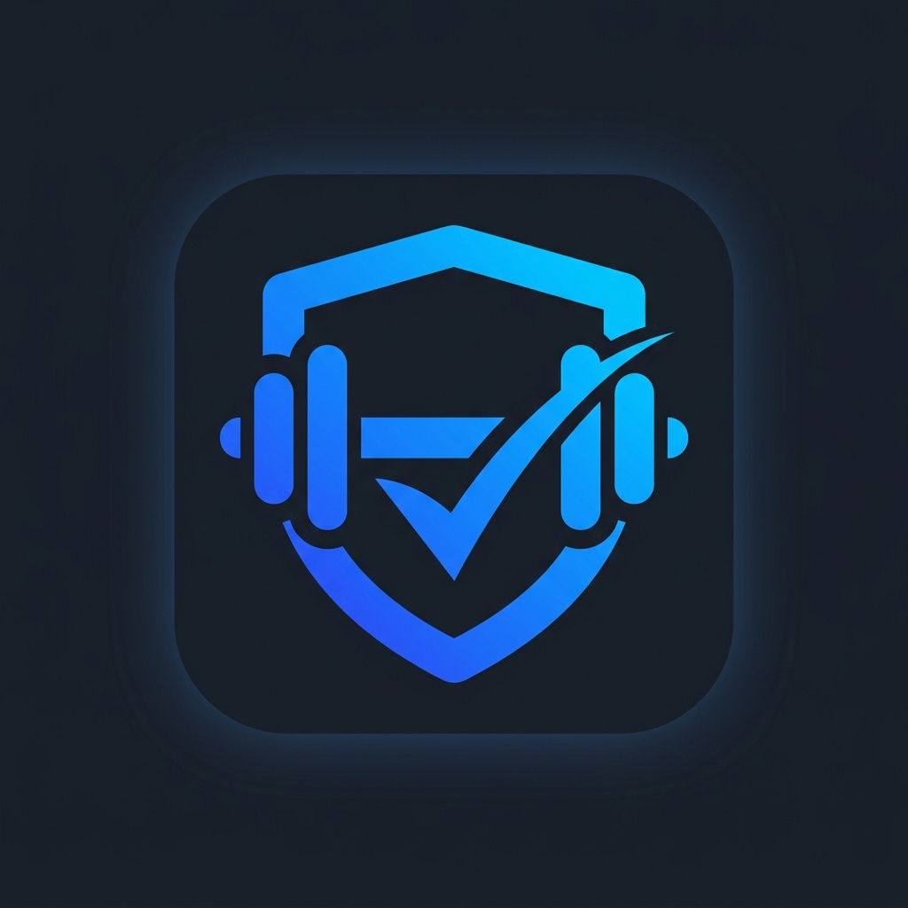
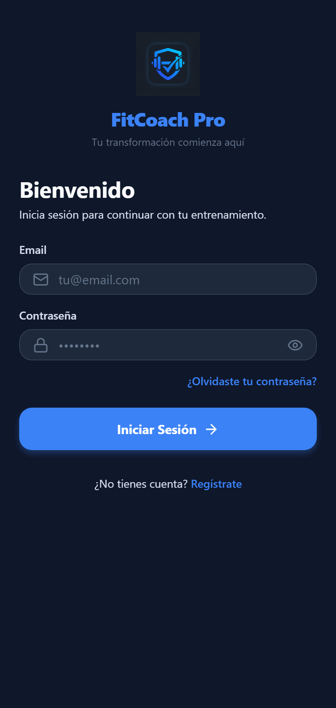
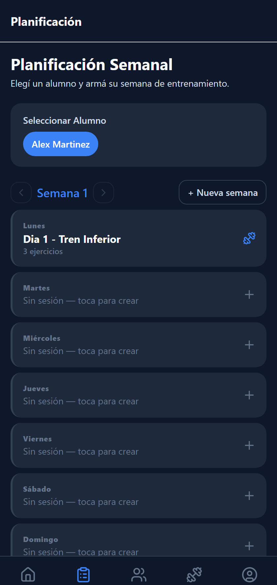
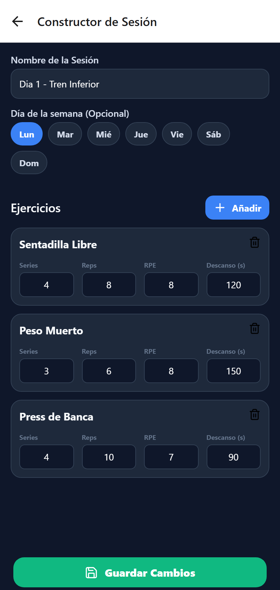
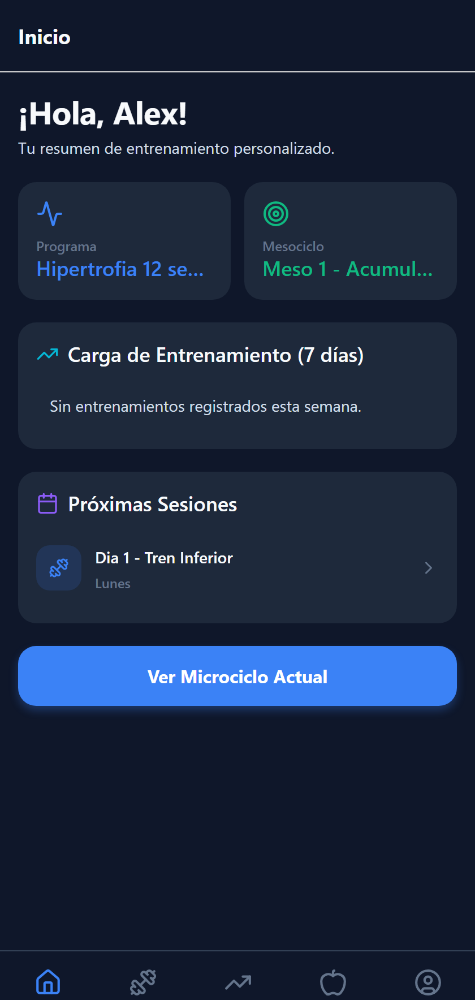
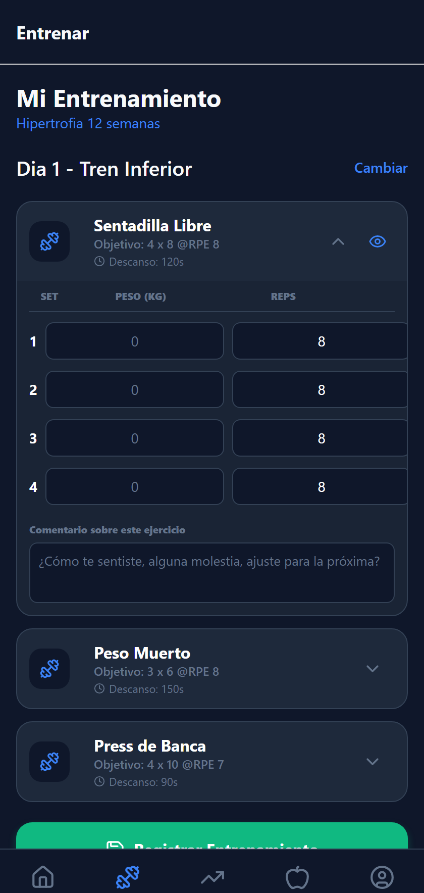

<p align="center">
  
</p>

<h1 align="center">FitCoach Pro</h1>

<p align="center">
  A full-stack personal training platform: coaches design periodized programs,<br/>
  clients execute and log them — end to end, on a real mobile app backed by a REST API.
</p>

<p align="center">
  
  
  
  
  
  
</p>

---

## What it does

FitCoach Pro connects a **Coach** with their **Clients** around one core loop: the coach designs a training plan, the client runs it and logs real numbers.

- **Coaches** build periodized programs (Program → Mesocycle → Microcycle → Session), plan by day of the week, attach reference images/GIFs to exercises, and track what each client actually did.
- **Clients** open their active program, log each set they perform (weight, reps, RPE/RIR) with per-exercise notes, view their history, and follow their nutrition targets.

It's a real multi-role product, not a demo shell: role-based access control, ownership checks on every endpoint, a secure password-reset flow, and a growing backend test suite back it up.

## Screenshots

<table>
  <tr>
    <td align="center"><br/><sub><b>Login</b></sub></td>
    <td align="center"><br/><sub><b>Coach · Weekly plan</b></sub></td>
    <td align="center"><br/><sub><b>Coach · Session editor</b></sub></td>
    <td align="center"><br/><sub><b>Client · Dashboard</b></sub></td>
    <td align="center"><br/><sub><b>Client · Log a workout</b></sub></td>
  </tr>
</table>

## Key Features

**Coach**
- Auto-provisioned weekly plan: select a client, get a ready-to-fill 7-day grid — no manual Program → Mesocycle → Microcycle setup
- Navigate and edit any past week, not just the current one
- Add, edit, or remove exercises from an already-saved session at any time
- Upload a reference image/GIF per catalog exercise (shared across all coaches, cached on-device)
- Client roster management (assign/unassign, one coach per client)

**Client**
- Active program view with the current week's sessions
- Log real sets during a workout (weight, reps, RPE/RIR) with a comment per exercise
- On-demand, cached reference image for any exercise via a single tap
- Workout history and a "last workout" summary on the dashboard
- Configurable nutrition macro targets

**Cross-cutting**
- Secure auth: one-time password-reset codes (never a plaintext password in an email), forced password change after reset, invite-code-gated coach registration
- Every endpoint enforces ownership (coach → via the client relationship, client → via their own user id) through role middleware and a shared authorization helper
- All API responses go through explicit Resource classes — no raw Eloquent models leak to the client
- Composite DB indexes on the planning tables that back the app's hottest queries

## Tech Stack

| Layer | Stack |
|---|---|
| **Mobile app** | React Native 0.86 + Expo SDK 57, TypeScript, NativeWind, Zustand, TanStack Query, React Navigation |
| **Backend API** | Laravel 13 (PHP 8.3), Laravel Sanctum (token auth), REST under `/api/v1` |
| **Database** | PostgreSQL (Neon serverless) |
| **Mobile infra** | `expo-secure-store` (encrypted token storage), `expo-image` (disk-cached media), EAS Build (APK distribution) |
| **Testing** | PHPUnit feature/unit tests on the backend |

## Project Structure

```text
FitCoach/ (pnpm workspace monorepo)
├── mobile/     # React Native + Expo app — the primary product, multi-role (Coach / Client)
├── backend/    # Laravel REST API (/api/v1), Sanctum auth, PostgreSQL
└── src/        # Figma-exported web prototype — design reference only, not a production surface
```

Domain model on the backend:

```text
User ─ UserProfile ─ MedicalHistory ─ Anthropometric ─ NutritionLog
  └─ CoachClient (coach ↔ client pivot, one coach per client)
Program → Mesocycle → Microcycle → WorkoutSession → SessionExercise (→ Exercise)
WorkoutExecution → ExecutionSet (the client's actual logged sets)
```

## Getting Started

### Backend (Laravel)
```bash
cd backend
composer install
cp .env.example .env        # fill in your Postgres credentials
php artisan key:generate
php artisan migrate
php artisan test            # 50+ tests, runs against an in-memory sqlite DB
php artisan serve           # http://127.0.0.1:8000
```

### Mobile (Expo)
```bash
cd mobile
pnpm install
# EXPO_PUBLIC_API_URL in mobile/.env must point at a reachable backend —
# 'localhost' does not work from a physical device or emulator.
# Use your machine's LAN IP, or tunnel the backend with ngrok:
ngrok http 8000
pnpm start
```

### Building an installable APK
The mobile app is configured for [EAS Build](https://docs.expo.dev/build/introduction/):
```bash
cd mobile
eas build --platform android --profile preview
```

## License

Private project — all rights reserved.
